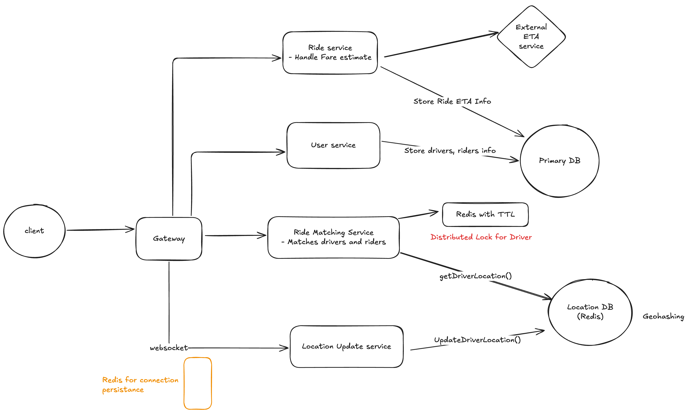

# Zapp

## Architecture

## Stack 

### Services 

- ORM: [gorm](https://gorm.io/)
- Routing: 

### DB Design 

Table: `Ride`

| Field           | Type            | Description                 |
|-----------------|-----------------| ----------------------------|
| id              | uuid            | Unique Identifier           |
| rider_id        | uuid            | Rider who request the ride  |
| driver_id       | uuid (nullable) | Driver who accepted the ride|
| pickup_location | Lat & long      | Rider location              | 
| destination     | Lat & long      | Destination                 | 
| status          | Enum            | Ride status                 | 
| estimated_pickup_time             | string          | The estimated time for the driver to arrive at the pickup location after accepting the ride request.|
| estimated_dropoff_time             | string          | The estimated time for the rider to reach the drop-off location after starting the ride.|

`Ride status enum`
- Requested – The rider has requested a ride, and the system is searching for an available driver.
- Accepted – A driver has accepted the ride request.
- Arriving – The driver is on the way to pick up the rider.
- Arrived – The driver has reached the pickup location.
- In Progress (Ongoing) – The ride is currently in progress; the rider is in the vehicle.
- Completed – The ride has ended, and the fare is calculated.

Table: `Driver`

| Field           | Type            | Description                 |
|-----------------|-----------------| ----------------------------|
| id              | uuid            | Unique Identifier           |
| email           | string          | Email                       |
| full_name       | string          | Full name                   |
| status          | ENUM            | Driver's status             |
| car_info        | string          | Driver's car info           |

Table: `Rider`
| Field           | Type            | Description                 |
|-----------------|-----------------| ----------------------------|
| id              | uuid            | Unique Identifier           |
| email           | string          | Email                       |
| full_name       | string          | Full name                   |